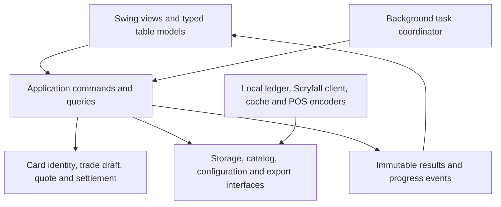

# OCC_PRICER repair implementation plan

Baseline: master at dcf68e64ef8a845f63ae4429360dc52b1cfb8c21 (4.1.6)  
Prepared: 2026-09-15  
Status: code implementation delivered; release acceptance pending; see [IMPLEMENTATION_STATUS.md](IMPLEMENTATION_STATUS.md) for delivered changes, verification and remaining acceptance work.

Read the [audit](ARCHITECTURE_AUDIT.md) for source evidence and the 38 finding IDs used below.

## Outcome

Make every trade reconstructible and financially consistent:

- One card identity survives lookup, duplication, condition edits, recovery and POS export.
- One calculation produces the displayed offer, approved settlement, receipt payout and exported acquisition cost.
- A failed export or network copy can be retried without creating another trade.
- Catalog refresh, preferences changes and background searches cannot silently alter the wrong record.
- A clean checkout builds and verifies on every proposed change.

Keep Java and Swing. Use an incremental modular application with clear boundaries; split the existing panels as those boundaries become available.

## Decisions and assumptions

These are acceptance inputs, not reasons to stop the audit.

| Decision | Working recommendation | Resolve before |
|---|---|---|
| POS schema/product/version | Obtain one accepted file per mode and a description of cost, extended cost and quantity columns. The current 19-column header is the starting fixture, not an external specification. | Shipping repaired exports |
| Legacy codes and finishes | Keep provider identity internally; implement COK/XED and finish mappings in an explicit POS adapter. Detect ambiguous merges. | Export acceptance |
| Payout defaults | Preserve current BuyRateService defaults, 50% credit/40% check, until an operator requests a policy change. Preserve configured tiers and bounties. | Pricing fixtures |
| Split tender allocation | Use an explicit proportional allocation across lines unless the business wants line-by-line allocation. Include MISC in settlement while excluding it only from POS stock rows. | Settlement implementation |
| Rounding and floors | Document raw price → floor/rounding → condition → payout order, and cent allocation. Preserve established behavior except confirmed contradictions such as applying NM turning a nonzero floor into zero. | Pricing release |
| Inventory semantics | Provide a clearly identified snapshot mode and a changes-only mode if needed. Untouched rows must not ambiguously mean “set stock to zero.” | Inventory rollout |
| Shared rate authority | Use revisions and explicit conflict handling; do not silently overwrite unsynced local edits with older shared settings. | Shared configuration rollout |
| Identification/contact fields | Decide which fields are required, retained, printed and copied to shared folders. Do not infer legal requirements. | Draft/receipt schema |

## Proposed architecture

### Domain data

- **PrintingIdentity:** Scryfall ID when available, exact provider set/collector number, language and original identifiers. Manual items have a separate local identity.
- **Finish and Condition:** enums, with finish availability distinct from price availability.
- **TradeLine:** line UUID, printing identity, raw name, finish, condition, quantity, base valuation, manual override and provenance. Display labels are derived.
- **TradeDraft:** draft UUID/revision, operator/customer fields, lines and payment selection. The policy for sensitive fields is explicit.
- **Quote:** price source timestamp, rule revision, per-line market/adjusted values, applied rates and payout alternatives.
- **Settlement:** chosen tenders, exact per-line acquired cost and rounding allocation, final totals.
- **CommittedTrade:** immutable approved snapshot with timestamp, application/schema versions and settlement.
- **ExportJob / SyncJob:** trade UUID, format/version, destination, content hash, status, attempt count and error.

A quantity change is a domain command, not an indirect mutation through a formatted JTable cell. A condition change always derives from the retained base valuation, never the previously discounted display price.

### Responsibilities

| Component | Responsibility |
|---|---|
| PricingEngine | Pure calculation: accepts typed values and a rate snapshot; returns quote/settlement results. No files, preferences, network or Swing. |
| TradeApplicationService | Add/edit/duplicate/remove lines; validate/finalize; coordinate recovery and exports. |
| CardRepository | Resolve exact printing identity, with a shared provider mapper for live and cached responses. |
| RateConfigurationRepository | Validate, migrate, version and persist rate snapshots; expose conflict information. |
| TradeRepository | Persist drafts/committed records with schema migration and stable IDs. |
| ExportEncoder | Produce one supported schema from a committed trade or catalog export input. Does not recalculate payouts. |
| TaskCoordinator | Bound concurrency, support cancellation and guard results by request/draft generation. |
| Swing presenters/table models | Render typed state and send commands. No service dependency on PreferencesPanel. |

For committed trades and export jobs, use a **local SQLite ledger** so committing a trade and scheduling its output tasks share a database transaction. SQLite supports atomic transaction commits; external CSV files and network copies still need separate retry/status handling. Keep the database on the workstation and synchronize documents or events, not a live database file on a network share. [SQLite atomic commits](https://www.sqlite.org/atomiccommit.html), [SQLite network filesystem considerations](https://www.sqlite.org/useovernet.html)

The catalog can remain an immutable in-memory index backed by a validated compressed snapshot initially. Measure memory before choosing an on-disk catalog index. Rate files exchanged between workstations should be versioned documents.

## Delivery sequence

The estimates below are rough effort for one engineer familiar with Java, excluding owner/account action and external POS acceptance delays. Expect approximately **5–8 engineer-weeks** for the full program. The first containment and export fixes should ship earlier, once their acceptance checks pass.

### Stage 0 — Contain credential and packaging exposure

**Findings:** F01, F02.  
**Effort:** 0.5–1 day, plus account-owner action.

1. Revoke the embedded app password at its provider. Record completion without recording the secret.
2. Remove shared SMTP credentials from the client and replace the report flow with a user-mediated submission mechanism.
3. Stage only approved application artifacts for jpackage. Keep package input and output separate.
4. Add generated/runtime data to ignore rules and ensure packages cannot include them.
5. Inspect prior release contents and coordinate replacement artifacts. History cleanup, if desired, is separate from credential revocation.

**Acceptance**

- Secret scanner finds no application credential in new source/artifacts.
- New packages contain no .git, IDE state, source checkout or runtime customer/trade data.
- Report submission works without a shared password in the desktop binary.
- Account owner confirms revocation; removing a literal alone does not satisfy this stage.

### PR 1 — Establish a reproducible build and regression baseline

**Findings:** F35; enables all later changes.  
**Effort:** 2–3 days.  
**Dependency:** none for build work; release remains gated on Stage 0.

1. Introduce Maven Wrapper with a pinned JDK 25 toolchain/release target.
2. Declare and pin dependency coordinates; verify the vendored JAR provenance before replacing them. Record license notices and scan actual resolved versions.
3. Separate source, resources and test fixtures using standard build paths or an explicitly configured transitional layout.
4. Convert the audit reproductions into normal tests of corrected expectations. Land fixes with their tests so the required branch remains green.
5. Add pull-request compilation/tests, and make release depend on those checks.
6. Keep live API checks optional and separate from deterministic unit/contract fixtures.

**Acceptance**

- One documented command verifies a clean checkout without IntelliJ.
- Windows CI compiles all source and runs deterministic tests.
- No tests access the user’s registry preferences, APPDATA, network share, email account or live POS.
- Test failures prevent release publication.

### PR 2 — Correct settlement and CSV output through one shared path

**Findings:** F03–F07, F12, F18–F21, F30, F32.  
**Effort:** 3–5 days.  
**Dependency:** PR 1; obtain POS fixtures before release.

1. Add a minimal typed quote/settlement result shared by quick-check, trade totals, receipt and POS export.
2. Correct the 19-column schema with named fields and one CSV encoder.
3. Replace exporter constants with actual per-line settlement amounts.
4. Validate the full split before any write: non-negative tenders, valid scale, valid rate, supported mode and reconciled amounts.
5. Define proportional mixed-tender allocation and deterministic cent residual handling. Do not spread MISC payout into unrelated stock costs.
6. Preserve entered splits across refreshes; mark them invalid when the draft changes.
7. Make every export enum case explicit. Fix per-set/combined zero-quantity parity, invoice footer width and CSV escaping.
8. Preserve finishes in outputs; expose unsupported mappings rather than silently collapsing them.
9. Keep numbers typed internally; use locale-independent machine output.
10. Fix name/code classification and use the same pricing pipeline in quick check.
11. Validate bounties/rule thresholds in the domain, and settle the floor/NM rule.

**Acceptance**

- $100 at default check rates settles and exports $40.00; an 80% bounty exports $80.00 credit acquisition cost.
- All CSV rows have the documented column count and field positions.
- Sum of exported costs for included stock lines matches their settlement allocation; MISC is reconciled separately.
- Duplicate/retry output is deterministic for the same committed input.
- Split cases include 100% credit, 100% check, mixed tiers, bounties, MISC, quantities, zero values and cent residuals.
- Negative splits and a zero/zero split for a nonzero payable trade are rejected before files appear.
- US and comma-decimal locales yield identical numeric export values.
- A real POS test import accepts approved fixtures for every supported mode.

### PR 3 — Replace parallel trade state with typed lines and commands

**Findings:** F08–F11, F20, F21, F29, F30.  
**Effort:** 4–6 days.  
**Dependency:** PR 2 calculation/encoding boundaries.

1. Introduce PrintingIdentity, Finish, Condition, TradeLine and TradeDraft.
2. Replace receivedCards/cardConditions/rowPayouts plus independently editable table values with a typed table model backed by draft state.
3. Route manual entry, code entry, quick check, search and paste import through one add-card operation returning added/skipped/error outcomes.
4. Duplicate with a new line ID while preserving finish, base valuation, override and condition.
5. Preserve original PLST/provider identifiers and special collector markers.
6. Make provider Card records immutable; keep all negotiated prices on draft lines.
7. Snapshot data by stable line ID for edits/undo, and make table sorting presentation-only.
8. Remove or adapt the unused two-sided Trade/OrderItem abstractions after reference checks.
9. Move CSV methods out of CardEntry and business logic out of Swing views.

**Acceptance**

- Normal, foil, etched, surge and PLST lines retain exact identity through all entry paths and duplication.
- The $10 NM → $8 LP duplicate remains $8 LP; changing back to NM restores the documented base.
- Sorting never redirects a condition/quantity edit or delayed callback to another line.
- Mutating a draft price cannot affect another draft or catalog lookup.
- Paste import reports actual inserted/skipped counts, including missing-price outcomes.
- Add-many operations emit bounded updates rather than recalculating the entire draft for every inserted card.

### PR 4 — Make drafts, finalization and history durable

**Findings:** F05, F08, F13, F14, F24, F25, F37, F38.  
**Effort:** 4–6 days.  
**Dependency:** PR 3.

1. Add local database schema and migration versioning for drafts, committed trades, settlements and export jobs.
2. Persist the full draft, including recoverable valuation/identity/payment state. Save after meaningful edits with a debounce; flush on orderly close.
3. Validate once, then commit an immutable trade and output jobs in one transaction.
4. Generate receipt/CSV from the committed snapshot. Record output status, content hash and retry information.
5. Use UUIDs and idempotency keys. Repeated finalize/retry must not duplicate a trade.
6. Drive history selection by trade ID. Build receipt rendering from structured records and preserve full line identity.
7. Migrate legacy preferences before defaults; migrate existing files with verified, resumable copies.
8. Import historical TXT as legacy records with original attachment and explicitly unknown fields. Do not invent information absent from old receipts.
9. Define recovery when a trade commits but CSV generation fails: show “saved, export pending” and provide retry without collecting another payment.

**Acceptance**

- A crash at each finalization boundary leaves either a recoverable draft or one committed trade with a retryable job.
- Failed export does not erase the only recovery state or create a second transaction.
- All-MISC trades finalize exactly once without requiring stock export rows.
- Two receipts for one customer in the same minute remain separately selectable and printable.
- Local preference migration preserves the seeded 90%/70% example and bounties.
- Migration can restart after interruption and leaves original data available.
- Unicode customer/card names survive supported receipt output.

### PR 5 — Make configuration and shared-folder synchronization explicit

**Findings:** F13, F15, F25, F31.  
**Effort:** 3–4 days.  
**Dependency:** PR 4 ledger/jobs.

1. Publish immutable validated configuration revisions and notify consumers through events.
2. Check the revision when saving rules or bounties; reject or merge stale edits deliberately.
3. Write shared snapshots atomically and retain a previous usable version.
4. Persist pending shared copies in the local ledger and retry with bounded backoff.
5. Use trade ID and content hash for deduplication and integrity; do not infer freshness from file length.
6. Expose saved locally, pending sync, synced and conflict states to operators.
7. Keep sensitive identifiers out of routine diagnostic logs.

**Acceptance**

- Two instances editing different configuration sections cannot silently erase each other’s work.
- A stale shared file cannot overwrite an unsynced newer local revision.
- A disconnected network share does not block pricing or lose a finalized transaction.
- Restart resumes pending copies; repeated sync does not duplicate records.
- Same-size differing files are detected as a conflict or hash mismatch.
- GUI remains responsive with a stalled share.

### PR 6 — Harden catalog lookup and refresh

**Findings:** F10, F11, F16, F17, F20, F29, F31.  
**Effort:** 3–4 days.  
**Dependency:** typed identity from PR 3; can be developed independently of later UI cleanup.

1. Share one provider mapper across API, bulk import and cache persistence.
2. Preserve exact printing IDs, raw collector markers, faces, artist and price/finish availability.
3. Load the last good cache first and show its age while refresh runs.
4. Coordinate startup and manual refresh as one operation.
5. Use a unique temporary file and validate schema/count/record integrity before replacing the old cache.
6. Centralize API policy, headers, throttling, timeouts and bounded retry; verify current provider requirements.
7. Measure loaded and refresh peak memory under the packaged heap; adopt an on-disk index only if measurements justify it.

**Acceptance**

- 73 and 73★ coexist and look up independently.
- Live and cached forms of the same fixture preserve equivalent identity and metadata.
- Refresh cancellation, malformed input, truncated gzip, failed write and concurrent requests preserve the last good cache.
- A stale offline cache remains available after network failure.
- A representative full catalog and draft fit the supported heap with measured headroom.

### PR 7 — Simplify UI lifecycle and repair operator workflows

**Findings:** F07, F22–F24, F26–F28, F31, F38.  
**Effort:** 3–5 days.  
**Dependencies:** application services available from PRs 3–6.

1. Split TradePanel into entry, table, customer/payment and finalization presenters backed by application services.
2. Introduce a task coordinator with cancellation and generation guards; dispose tasks/timers when appropriate.
3. Remove shared/disk I/O from summary, filtering and preview callbacks.
4. Add clear loading/dirty states for inventory and protect reload/navigation/exit.
5. Snapshot selectedSet before a load and track it separately from the selector.
6. Give bulk exports a run manifest and output directory. Surface per-set, combined, cancelled and failed outcomes.
7. Fix image error handling and timeouts.
8. Separate PDF saving, opening and printing results.

**Acceptance**

- Slow search A cannot overwrite newer search B; changing finish also changes request identity.
- Closing an import dialog or clearing/finalizing a draft prevents stale additions.
- Failed new-set load preserves previous inventory edits.
- Export filenames match the actual loaded set.
- Smaller subsequent bulk runs cannot expose files from an older generation as current.
- Combined-file failures are shown as failures.
- Measure UI responsiveness with a large draft and slow file share; set an explicit team-approved latency budget.

### PR 8 — Finish packaging, versioning and documentation

**Findings:** F02, F33–F36.  
**Effort:** 2–3 days.  
**Dependencies:** stabilization above.

1. Generate AppVersion, package version and update metadata from one version source.
2. Define suffix/prerelease ordering and test updates from already distributed suffix-style versions.
3. Repair macOS source-path handling and icon sizes.
4. Add Windows/macOS CI packaging and artifact inspection, with an explicit supported platform list.
5. Publish release artifacts only after required tests and smoke checks pass.
6. Update operator help, release notes, storage/recovery instructions, POS schema docs and contributor README.
7. Remove obsolete labels, unsupported size/performance claims, dead files and IDE-specific dependency assumptions.

**Acceptance**

- A clean checkout with spaces/Unicode in its path builds on each supported OS.
- Application/About/package/tag/update versions agree.
- Update from a suffix-style version detects the next release.
- A packaged application starts and completes fixture trade → receipt → CSV → recovery/history workflows.
- Packages contain only approved payload.
- Documentation describes the current rates, features and limitations accurately.

## Test matrix

| Axis | Representative cases |
|---|---|
| Identity | Normal, F/E/S, PLST, collector punctuation, provider/legacy alias, manual MISC, two printings with similar names |
| Price | Missing vs zero; rarity minima; $9.25/$9.50/$9.75/$10; raw vs rounded; manual override; NM/LP/MP/HP/DMG |
| Rates | Catch-all; exact threshold and just above; bounty; duplicate threshold; invalid/zero/out-of-range rate policy |
| Quantity | One, repeated items, large valid quantity, invalid zero/negative, overflow boundary |
| Payment | Credit, check, proportional partial, mixed rules/bounties, MISC-only, mixed MISC/stock, cent residual |
| CSV | Every supported schema; quoted names; commas; quotes; newlines; Unicode; empty fields; locale invariance |
| Recovery | Every stored field, interrupted draft save, interrupted commit/output, old preferences and old TXT |
| Concurrency | Out-of-order results, same draft edited during lookup, simultaneous cache refresh, two configuration writers |
| I/O | Full disk, denied path, missing folder, disconnected share, failed rename, corrupt JSON/gzip |
| Release | Clean checkout, non-ASCII/path spaces, artifact contents, version consistency, packaged heap and startup |

Use a small set of real anonymized POS-accepted files as contract fixtures once supplied. Production customer records are unnecessary for deterministic tests.

## Rollout and rollback

1. Keep each PR narrow enough to review and trace to findings.
2. Back up existing local data before running migrations; verify migration manifests and record counts.
3. Compare old/new output on fixtures, documenting intentional corrections such as the 40% default check payout.
4. Pilot on one workstation using nonproduction POS imports.
5. Observe export reconciliation, recovery and pending-sync behavior before broader rollout.
6. Retain the previous application package and data backup. New schemas must reject incompatible older writers; rollback restores a compatible backup instead of having an old binary write newer data.
7. Release urgent validated corrections ahead of the full structural program.

## Completion criteria

The repair program is complete when all P0/P1 findings are resolved, remaining accepted product risks are documented, every advertised export mode passes POS contract tests, loss/retry scenarios are proven, and the operator can reproduce any committed trade from structured data with exactly the same payout and identity.

The immediate next work item is Stage 0 plus PR 1, followed by the settlement/CSV fixes in PR 2.
